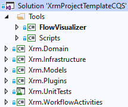
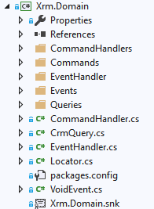
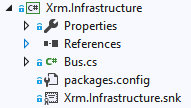
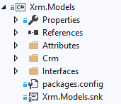
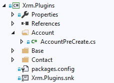
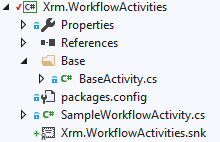

# XRM Project Template CQS

<!-- Start Document Outline -->

* [XRM Project Template CQS](#xrm-project-template-cqs)
	* [Purpose](#purpose)
	* [Commands, events and queries](#commands-events-and-queries)
	* [How does it work?](#how-does-it-work)
		* [The flow](#the-flow)
		* [Command](#command)
		* [Plugins](#plugins)
		* [Queries](#queries)
		* [Command handler](#command-handler)
		* [Events and event handlers](#events-and-event-handlers)
		* [VoidEvent?](#voidevent)
		* [Summary](#summary)
	* [Testing](#testing)
		* [Approach to testing](#approach-to-testing)
		* [Example](#example)
	* [Solution components](#solution-components)
		* [Xrm.Domain](#xrmdomain)
		* [Xrm.Infrastructure](#xrminfrastructure)
		* [Xrm.Models](#xrmmodels)
		* [Xrm.Plugins](#xrmplugins)
		* [Xrm.UnitTests](#xrmunittests)
		* [Xrm.WorkflowActivities](#xrmworkflowactivities)
	* [Custom dependencies](#custom-dependencies)
	* [Handling transactions](#handling-transactions)
	* [Tools](#tools)
		* [Built-in](#built-in)
		* [External](#external)
			* [DAXIF#](#daxif)
			* [Fake-XRM-Easy](#fake-xrm-easy)
			* [Autofac](#autofac)
			* [ILMerge](#ilmerge)

<!-- End Document Outline -->

## Purpose

The main purpose of this repository is to provide a clean solution template for building XRM (Dynamics CRM / Dynamics 365 CE) projects. Inspired by the <a href="https://en.wikipedia.org/wiki/Command–query_separation" target="_blank">CQS (Command-Query-Seperation)</a> principle and the <a href="https://en.wikipedia.org/wiki/SOLID" target="_blank">SOLID</a> principles. The aim is to build the solution with small, testable, maintainable and non-conflicting (in sense of source control) blocks. At the same time the amount of non business logic related code should be minimized if not avoided completely.

As the name suggests the template enforces an CQS inspired coding style. There should be a clear separation between code that modifies state (Commands) and code that reads state (Queries). No single method (or in this case even class) should do both. Additionally having separate classes for handling each command results in small, single purpose, classes which are easy to maintain and test.

## Commands, events and queries

The program flow is created using 3 main building blocks:
1. Commands - telling the system to do something, for example "UpdateChildContactCount" command in the context of an Account. Each ***command*** should by design have exactly one ***command handler***, which contains the implementation of handling the command.
2. Events - telling the system that something has happened, for example "ChildContactCountUpdated". Each ***event*** can have any number (0..N) subscribed ***event handlers***, which contain the implementation of handling the event.
3. Queries - used to retrieve data from CRM

Commands and events depend on the queries (since often the decision what to do depends on data we need to retrieve). 

***Queries*** depend only on CRM. Commands and events don't do any query data directly, instead they do it through the queries. ***Commands***, when done, can raise events. ***Events***, when done, can raise events. The image below depicts their interactions.


## How does it work?

### The flow

Let's assume we want to implement a flow like this: Whenever a contact is created or updated it's parent accounts name should be updated to reflect how many child contacts it has - something like "I have {N} contacts". After this is done, the contacts last name should be updated to something like "My parent account has {N} contacts". Then after this is done a not should be created on the contact with text like "I am a note".

The solution involves a new component, that has previously not been mentioned - the command and event **bus**. Without going into details - it's something that's responsible for executing command handlers for commands and event handlers for events. Additionally it takes care of injecting all required dependencies.

The flow described above should look something like this:

```
SetAccountNrOfContactsCommand
   -> AccountNrOfContactsSetEvent
       -> AccountChildContactCountSetInLastNameEvent
```

Because the trigger will be an create or update of a Contact and part of the flow touches the same contact that triggered the flow, we'll implement it using 2 pre-operation plugins: ContactPreCreate and ContactPreUpdate.

### Command

We start by defining the ***Command*** the plugins will be issuing. This can be something like:

```csharp
public class SetAccountNrOfContactsCommand : ICommand
{
    public Contact FromContact { get; set; }
}
```

This is just a simple POCO class, implementing an empty ```ICommand``` interface.

### Plugins

Next let's create our two plugins:

```csharp
public class ContactPreCreate : Base.Plugin
{
    public ContactPreCreate() : base(typeof(ContactPreCreate))
    {
        RegisterPluginStep<Ctx.Contact>(EventOperation.Create, ExecutionStage.PreOperation, Execute);
    }

    private void Execute(LocalPluginContext localContext)
    {
        Ctx.Contact targetContact = localContext.GetTarget<Ctx.Contact>();

        var setAccountNrOfContactsCommand = new SetAccountNrOfContactsCommand
        {
            FromContact = targetContact
        };
        CommandBus.Handle(setAccountNrOfContactsCommand);
    }
}
```

```csharp
public class ContactPreUpdate : Base.Plugin
{
    public ContactPreUpdate() : base(typeof(ContactPreUpdate))
    {
        RegisterPluginStep<Ctx.Contact>(EventOperation.Update, ExecutionStage.PreOperation, Execute);
    }

    private void Execute(LocalPluginContext localContext)
    {
        Ctx.Contact targetContact = localContext.GetTarget<Ctx.Contact>();

        var setAccountNrOfContactsCommand = new SetAccountNrOfContactsCommand
        {
            FromContact = targetContact
        };
        CommandBus.Handle(setAccountNrOfContactsCommand);
    }
}
```

If you don't recognize the above code, this is because the ***XRM Project Template*** uses a slightly customized version of the <a href="https://github.com/delegateas/Daxif/" target="_blank">Delegate DAXIF#</a> framework. The main feature we utilize here is automatic plugin registration, based on metadata in the code itself - the ```RegisterPluginStep``` method. Also all the things you would normally expect in the plugin, like obtaining the CRM's ``IOrganizationService`` reference, ``ITracingService`` and ``IPluginExecutionContext`` are already handled in the ```Base.Plugin```. This follows the philosophy, explained on top of this page, of avoiding any unnecessary filler code and focusing only on what is absolutely required. 

All this plugin does is setup a simple ***Command*** a  and pass it over to the ***Command bus***, which will try to find a suitable ***Command handler*** and execute it.

### Queries

Let's leave the ***Command bus*** implementation a black box. Ideally you will never need to touch it (except for maybe adding new dependencies into the DI Container - described later). Right now we have a ***Command*** so we need an corresponding ***Command handler***. But we can also foresee it will need some way to get the number of child contacts of a certain account. So let's start by creating a query:

```csharp
public class AccountQueries : CrmQuery<Account>
{
    public AccountQueries(IOrganizationService orgService) : base(orgService) { }

    public int GetNrOfContacts(Guid accountId)
    {
        using (XrmContext xrm = new XrmContext(OrgService))
        {
            return xrm.ContactSet
                      .Where(c => c.ParentCustomerId != null && c.ParentCustomerId.Id == accountId)
                      .Select(c => c.Id)
                      .ToArray()
                      .Length;
        }
    }
}
```

Any ***Query*** should be a class extending the abstract ```CrmQuery<TEntity>``` class. The command bus will automatically set any constructor injected dependencies. In this case we only need a reference to the ```IOrganizationService```. Next we just implement the query method we need, in this case ```GetNrOfContacts```.

### Command handler

Having the required query, we can implement the ***Command handler***:

```csharp
public class SetAccountNrOfContactsCommandHandler : CommandHandler<SetAccountNrOfContactsCommand, AccountNrOfContactsSetEvent>
{
    private readonly AccountQueries accountQueries;

    public SetAccountNrOfContactsCommandHandler(FlowArguments flowArgs,
        AccountQueries accountQueries)
        : base(flowArgs)
    {
        this.accountQueries = accountQueries ?? throw new ArgumentNullException(nameof(accountQueries));
    }

    public override AccountNrOfContactsSetEvent Execute(SetAccountNrOfContactsCommand command)
    {
        command.FromContact = command.FromContact ?? throw new ArgumentNullException(nameof(command.FromContact));

        if (command.FromContact.ParentCustomerId == null)
        {
            return null;
        }

        int nrOfContacts = accountQueries.GetNrOfContacts(command.FromContact.ParentCustomerId.Id);

        Account account = new Account
        {
            Id = command.FromContact.ParentCustomerId.Id,
            Name = $"I have {nrOfContacts} contacts"
        };
        orgServiceWrapper.OrgServiceAsSystem.Update(account);

        return new AccountNrOfContactsSetEvent { TargetContact = command.FromContact };
    }
}
```

A command handler is a class inheriting from ```CommandHandler<TCommand, TResultEvent>```. In other words it handles a command of type ```TCommand``` and when done produces an event of type ```TResultEvent```. In this case, according to the requirements, we handle a ```SetAccountNrOfContactsCommand``` and raise an ```AccountNrOfContactsSetEvent```. All the required dependencies should be defines in the constructor. One of them - ```FlowArguments``` - is required by the base class, it bundles together the minimum required dependencies, like the ```IOrganizationServiceWrapper``` (specific to plugins and custom workflow activities - aggregates the service in the context of the current user and the SYSTEM user) and ```IEventBus``` (for handling events). All other dependencies are up to the author of the command handler.

> In the constructor take in only the dependencies you require in this specific command handler. Every command and event handler is constructed independently and on demand by the event bus. 
> For passing around state use the Command and Event POCO objects.

How does a command handler work? If you look at the source of ```CommandHandler<TCommand, TResultEvent>``` you'll see it's a simple implementation of the <a href="https://en.wikipedia.org/wiki/Template_method_pattern" target="_blank">template method pattern</a>.

```csharp
public abstract class CommandHandler<TCommand, TPostEvent>
{
    public CommandHandler(FlowArguments flowArgs)
    {
        // ...
    }

    public void Handle(TCommand command)
    {
        if (!Validate(command)) { return; }

        TPostEvent postEvent = Execute(command);
        
        if(postEvent != null && postEvent.GetType() != typeof(Events.VoidEvent))
        { 
            eventBus.NotifyListenersAbout(postEvent);
        }
    }

    public virtual bool Validate(TCommand command) { return true; }

    public abstract TPostEvent Execute(TCommand command);
}
```
(Simplified a little compared to the actual implementation, but not much :wink:)

1. It calls the virtual ```Validate``` method, with the command as argument. Because the method is virtual it's not required to be implemented in classes extending ```CommandHandler<TCommand, TResultEvent>```. If you want to implement your own validation it should be here. Either return false if you want it to silently fail (stop the flow) or throw an exception if you want it to be loud :bomb:.
1. It calls the abstract ```Execute``` method, which takes in the command and returns an event. This method is abstract, so it's required to be implemented (else the whole command handler wouldn't make much sense).
1. If the event is not-null and not an ```VoidEvent``` it will ask the event bus to notify all listeners about it (0 or more). Conversely if you return null or a ```VoidEvent``` the flow will stop at this command handler. 
 
### Events and event handlers

To finish up, we need to create the two events and event handlers. How this works is almost the same as for commands and command handlers.

```csharp
public class AccountNrOfContactsSetEvent : IEvent
{
    public Contact TargetContact { get; set; }
}
```

```csharp
public class AccountNrOfContactsSetEventHandler : EventHandler<AccountNrOfContactsSetEvent, AccountChildContactCountSetInLastNameEvent>
{
    public AccountNrOfContactsSetEventHandler(FlowArguments flowArgs) : base(flowArgs)
    {
    }

    public override AccountChildContactCountSetInLastNameEvent Execute(AccountNrOfContactsSetEvent @event)
    {
        // ...

        return new AccountChildContactCountSetInLastNameEvent
        {
            // ...
        };
    }
}
```

```csharp
public class AccountChildContactCountSetInLastNameEvent : IEvent
{
    // ...
}
```

```csharp
public class AccountChildContactCountSetInLastNameEventHandler : EventHandler<AccountChildContactCountSetInLastNameEvent, VoidEvent>
{
    public AccountChildContactCountSetInLastNameEvent(FlowArguments flowArgs) : base(flowArgs)
    {
    }

    public override VoidEvent Execute(AccountChildContactCountSetInLastNameEvent @event)
    {
        // ...

        return VoidEvent;
    }
}
```

We didn't fill in all the code above because it's mostly implementation detail, but it shows how a flow should be built out of it's simple building blocks.

### VoidEvent?

You might wander about this line: ```return VoidEvent;```. Fortunately the is nothing magical about it. There is a class called ``VoidEvent`` so this could be written like so ```return new VoidEvent()```, but that's a bit ugly. Similar to how ASP.NET MVC has factory methods inside the Controler class (like ```return View()```, instead of ```return new View()``` we have a simple factory property in both the ```CommandHandler<T1,T2>``` and ```EventHandler<T1,T2>``` base classes.

```protected Events.VoidEvent VoidEvent => new Events.VoidEvent();```

### Summary

That's it.

The example above might seem a bit complex at first, but bear in mind all you really need to do is create the command / event POCO classes and implement the ```Execute``` methods of their respective handlers. When you create a new handler and inherit from ```CommandHandler<T1,T2>``` or ```EventHandler<T1,T2>``` most of the code (including the minimum required constructor) will be generated automatically by Visual Studio if you Ctr+Space a few time on the red squiggles.

Again the purpose here is to have small, maintainable and testable classes instead of 5000 line long monster "Services" and "Repositories".

## Testing

### Approach to testing

As mentioned a few times before, one of the main purpose of the proposed architecture is encourage unit testing. Small classes with dedicated purposes make it easy. 

For unit testing command and event handlers the following convension can be used:
1. Setup CRM state (if required).
1. Setup a command / event.
1. Pass it to the bus.
1. Assert the output event is correct.
1. Assert the CRM state is correct (if required).

> The bus has a property called ```DoNotPropagateEvents``` which will stop any event propagation. By default it's obviosly false, but you should set it to true if you want to test a single command or event handler.   
> On the other hand if what you want to test is the full flow - leave it as false, start from a command and assert the resulting state of the system is what you expect.

For queries it's even simpler:
1. Setup CRM state.
1. Run the query.
1. Assert the result is what you expect it to be.

The solution contains a sample unit testing project called Xrm.UnitTest which is pre-configured and ready to go. It uses the <a href="https://github.com/jordimontana82/fake-xrm-easy" target="_blank">Fake-Xrm-Easy</a> library for creating an in-memory version of CRM / Dynamics CE. There are other libraries like this avaialble, but this one is very easy to use and performant.

The Xrm.UnitTest project contains a helper class called ```BaseCrmTest``` from which all unit tests should inherit. It takes care of wiring up all required components, makes the test classes smaller and avoids code repetetions.

### Example

This is how a sample unit test class would look like:

```csharp
[TestClass]
public class SetAccountNrOfContactsCommandHandlerTests : BaseCrmTest
{
    private readonly Guid accountId = Guid.NewGuid();
    private readonly Guid triggerContactId = Guid.NewGuid();

    public SetAccountNrOfContactsCommandHandlerTests()
    {
        Account account = new Account { Id = accountId, Name = "" };
        Contact[] contacts = new[]
        {
            new Contact { Id = Guid.NewGuid(), ParentCustomerId = null },
            new Contact { Id = triggerContactId, ParentCustomerId = new EntityReference(Account.EntityLogicalName, accountId) },
            new Contact { Id = Guid.NewGuid(), ParentCustomerId = new EntityReference(Account.EntityLogicalName, Guid.NewGuid() ) },
            new Contact { Id = Guid.NewGuid(), ParentCustomerId = new EntityReference(Account.EntityLogicalName, accountId) },
            new Contact { Id = Guid.NewGuid(), ParentCustomerId = null },
        };

        Context.Initialize(new Entity[] { account }.Union(contacts));
    }

    [TestMethod]
    public void AccountsNameIsCorrectlySet()
    {
        SetAccountNrOfContactsCommand cmd = new SetAccountNrOfContactsCommand { FromContact = GetTriggeringContact() };

        CmdBusWithNoEventPropagation.Handle(cmd);

        Account account = GetTargetAccount();

        Assert.AreEqual($"I have 2 contacts", account.Name);
    }

    [TestMethod]
    public void ThrowsArgumentNullExceptionWhenPassingNullContact()
    {
        SetAccountNrOfContactsCommand cmd = new SetAccountNrOfContactsCommand { FromContact = null };

        Assert.ThrowsException<ArgumentNullException>(() => CmdBus.Handle(cmd));
    }

    private Contact GetTriggeringContact()
    {
        return OrgService.Retrieve(Contact.EntityLogicalName, triggerContactId, new ColumnSet(true))
                         .ToEntity<Contact>();
    }

    private Account GetTargetAccount()
    {
        return OrgService.Retrieve(Account.EntityLogicalName, accountId, new ColumnSet(true))
                      .ToEntity<Account>();
    }
}
```

The setup is pretty straightforward:
1. Initialize the CRM state inside the constructor, by calling ```Context.Initialize(Entity[] entities)```.
1. Perform you unit tests.

You can notice a few things:
1. ```OrgService``` is the faked organization service reference.
1. ```CmdBus``` is the standard command bus.
1. ```CmdBusWithNoEventPropagation``` is a command bus with the ```DoNotPropagateEvents``` property set to ```true```.

## Solution components

The XRM Project Template CQS solution is built out of multiple projects.



Let's look into their purpose one by one.

### Xrm.Domain



This is the project you'll be working with the most. It holds are the core components - commands, command handlers, events, event handlers and queries. By convention they should be placed into their appropriate folders / namespaces, although technically the whole assembly is scanned, so they will work fine wherever you place them.

> It's absolutely fine and even recommended to create a deeper structure. So instead of putting all commands directly into the ```Commands``` folder you might create sub folders like ```\Commands\Marketing```, ```\Commands\Security```, ```\Commands\SharePointIntegration``` etc. Same goes for command handlers, events, event handlers and queries.

> Do not delete the files at the root of the project. Those are common classes which are required for the solution to work.

### Xrm.Infrastructure



Common place for shared infrastructure code. Initially it only contains the implementation of the command / event bus, but you might extend this with your own dependencies.

### Xrm.Models



This project contains the solution shared model classes. These include some infrastructure related interfaces and attributes and the generated CRM early bound entities (inside the Crm folder).

The Crm folder also contains some helper classes generated by the DAXIF# scripts.

> Note: The solution uses the latest version of the DAXIF# scripts, which are built for CRM 9 and have some helper methods to handle multi value option sets. This helper code is generated automatically every time you refresh the CRM early bound entities, so it's not suitable for editing. In order to make that work with earlier (pre 9) version of the SDK a fake ``OptionSetValueCollection`` class has been added in ```Xrm.Models\Crm\OptionSetValueCollection.cs```. It can (and probably should) be deleted if you're working with CRM 9 or later.
> Needless to say - don't use the multi value option set helper methods if you're working with CRM older than version 9.

### Xrm.Plugins



Contains the CRM plugins. See the [Plugins](#plugins) section for more information about how they should be structured. All the plugins should do create a command with the appropriate state and ask the command bus to handle it. ***They should not*** contain any business logic baked in. That is the responsibility of command and event handlers.

The general approach should be one plugin per entity / event / stage combination, so there are valid plugins:
1. PreAccountCreate
1. PostAnyEntityRetrieve
1. PostContactSetStateDynamicEntity

But these are not:
1. CopyContactInfoToLeadPlugin
1. SharePointSecuritySyncPlugin
1. CalculateTotalValuePlugin

Those are commands, not plugins. The only role of a plugin is to ***route*** events in CRM into appropriate commands. It also maps perfectly into the DAXIF# automatic plugin registration tooling.

Just like on the picture above, it might be a good idea to create a separate folder for each entity, to not end up with hundreds of files on the same level.

### Xrm.UnitTests

Sample unit testing project, with the Fake-XRM-Easy library pre-configured. See [Testing](#testing) for more details.

### Xrm.WorkflowActivities



Sample project for creating custom workflow activities (which should see less usage, because of custom actions, but still have their place). Unfortunately the DAXIF# scripts don't support automatically syncing those, so it has to be done manually. References to the Infrastructure and Domain projects have been added. When creating new workflow activities, they should inherit from ```Base\BaseActivity.cs```, which will wire up all dependencies and give you an instance of the command bus to work with.

## Custom dependencies

The command / event bus takes care of constructor injecting dependencies into any required command or evewnt handler. In the base template this includes the following:
1. The CRM organization service wrapper ```OrganizationServiceWrapper``` (bundles together the organization service in the context of the current user and the system user)
2. An instance of ```ITracingService```
3. Any requested ```CrmQuery<TEntity>``` implementation

When creating a solution you might need to include additional dependencies, like for example a JSON serializer or external web service client.

The suggested approach is to add those to the ```Xrm.Infrastructure``` project and register them in the Autofac dependency injection container inside the constructor of the ```Bus``` class.

```csharp
public Bus(IOrganizationServiceWrapper orgServiceWrapper, ITracingService tracingService)
{
    this.orgServiceWrapper = orgServiceWrapper ?? throw new ArgumentNullException(nameof(orgServiceWrapper));

    var builder = new ContainerBuilder();

    Assembly domain = typeof(Locator).Assembly;

    builder.RegisterInstance<IEventBus>(this);
    builder.RegisterInstance(orgServiceWrapper);
    builder.RegisterInstance(tracingService);
    builder.RegisterType(typeof(FlowArguments));
    builder.RegisterAssemblyTypes(domain).AsClosedTypesOf(typeof(IHandleCommand<>));
    builder.RegisterAssemblyTypes(domain).AsClosedTypesOf(typeof(IHandleEvent<>));
    builder.RegisterAssemblyTypes(domain).AsClosedTypesOf(typeof(CrmQuery<>));

    /// Add custom dependencies below
    /// --- End of custom added dependencties

    container = builder.Build();
}
```

Consult the <a href="https://autofac.readthedocs.io/en/latest/" target="_blank">Autofac docs</a> for specific instructions, but in many cases it's as simple as adding a single line like this:

```csharp
builder.RegisterIntance(new MyCustomDependency());
```

## Handling transactions

When creating plugins or custom workflow activities all interactions with CRM are automatically wrapped into a database transaction, so in case of errors (exceptions) everything is rolled back. This is not the case when developing external tools that *talk to* Dynamics CRM / CE. If in an external tool scenario (like a portal or batch jobs console application) you need transactional rollback functionality the SDK offers the ```ExecuteTransactionRequest```, which is supported by this template.

The assumption here is that either the whole flow (of commands and events) should succeed or be rolled back. If you need transaction support on a more granular level this can be implemented manually.

In the standard scenario you'd be using the ```orgServiceWrapper.OrgService``` and ```orgServiceWrapper.OrgServiceAsSystem``` CRM service references. If you need to wrap the requests into an ```ExecuteTransactionRequest```, the only change you need to do is use ```orgServiceWrapper.TransactionalOrgService``` or ```orgServiceWrapper.TransactionalOrgServiceAsSystem``` instead. All the requests you do (Create, Update, Delete, Execute, ...) will be queued up and executed in a single transaction **once the whole flow is completed** (the command handler and all event handlers have executed). 

> **Important!** The ```orgServiceWrapper.TransactionalOrgService``` and ```orgServiceWrapper.TransactionalOrgServiceAsSystem``` have separate transactional request queues. If you use both within the same flow, there will be 2 independent transactions executed in CRM.

> Because the transaction is only executed when the flow is completed, you will not be able to query the data you have created / updated while inside the flow. If you need to keep track of that, consider passing it through inside the event objects.

> If you need ID's (GUID's) of records you create - so you can, for example, set them as a reference in another record - remember you *can* assign an ID to a record before it's created. CRM will use it when creating the record. Doing something like ```new MyEntity { Id = Guid.NewGuid() }``` should be OK in most scenarios. You can then pass that ID (or even the whole object) as part of the subsequent events.

> There is no explicit commit or rollback. If the flow completes, all the queued up requests are executed inside a single transaction. This can either succeed or fail as a whole. If at any point an exception is thrown and the flow is broken, those requests will never be executed.

> Each flow instance has it's own transaction queues. They are not shared.


## Tools

### Built-in

Figuring out the exact flow of commands and events can become confusing. Part of the solution is a simple tool called ***FlowVisualizer*** found in Tools\FlowVisualizer. It's a simple console application that scans the Domain assembly (containing your commands, events etc.) and prints out a visual representation of the configured flows.

Additionally it also detect infinite event loops, which might help detect errors in the configuration. An event loop happens when an event handler further in the flow produces an event that was handled previously.

For example consider this flow:
```
    CommandHandler1: Command1 -> Event1
        -> EventHandler1: Event1 -> Event2
            -> EventHandler2: Event2 -> Event1
                -> EventHandler1: Event1 -> Event2
                    -> EventHandler2: Event2 -> Event1
                        -> ...
```
EventHandler1 procuces Event2, then EventHandler2 produces Event1 and it starts looping. If you try to run such a plugin in CRM it would most likely just time out or maybe produce a stack overflow exception.

An example output of the tool currently looks like this:


> You can save the output to a text file, by running ```FlowVisualizer.exe > output.txt```

### External

Except the obvious dependency on the Microsoft CRM SDK, the solution uses the following Open Source tools and libraries:

#### DAXIF#

This is a collection of tools and scripts for automating development of Dynamics CRM / CE solutions. It offers a lot of tools, details of which are described in the <a href="https://github.com/delegateas/Daxif" target="_blank">docs</a>. What the XRM Project Template CQS solution utilizes at this moment are only 2 of them:
1. The ability to generate the early bound entities
2. Automated plugin synchronization based on metadata in the code.

Setup is pretty straightforward:
1. Look into Tools\Scripts\Daxif.
2. Open the _Config.fsx file and put in your development environment URL (and optionally credentials), solution name etc.
3. Run GenerateCSharpContext.fsx for refreshing the early bound entities. Notice the list of entities to include in the generated file.
4. Run PluginSyncDev.fsx for syncing your plugins to the development environment

> See the note in [Xrm.Models](#xrmmodels) when working with CRM 9 or later

#### Fake-XRM-Easy

Unit testing framework for Dynamics CRM / CE projects. Full docs found <a href="https://dynamicsvalue.com/" target="_blank">here</a>.

#### Autofac

This very popular dependency injection container (or how its authors call it an Inversion of Control container) is used inside the command bus for dynamically creating instances of the command and event handlers. In most cases when using this solution template you won't need to interact with it, except the few cases when you need to introduce new dependencies. This is explained in more detail in the [Custom dependencies](#custom-dependencies) section.

#### ILMerge

The solution template contains multiple projects resulting in multiple output dll's. When you register a CRM plugin it needs to be a single dll (except the case you put some of them in the GAC / assembly\bin but that's an anti-pattern). The solution is to merge all dll's into a single one - that is what the popular ILMerge tool does. It's already configured to run at build for the current project setup, but you might need to look into into when adding new dependencies. The detection of merged assemblies is automatic. It merges all the assemblies in the output folder. In practice all you need to do is make sure the referenced dll you want to merge is configured with Copy Local equal to true, which is the default when you add a new reference. Just make sure to add all new references not only to the place where they are used (like the Xrm.Domain project), but also the Xrm.Plugins project. Take care to not "copy local" assemblies that shouldn't be merged into the result plugin - like the CRM SDK assemblies.

